# cite-rag-mcp

> A local MCP server for researchers who want AI-assisted writing without fake citations.

`cite-rag-mcp` connects Codex, Zotero, Better BibTeX, DOI metadata services, and Pandoc into one evidence-safe academic citation workflow. It helps you retrieve verified references, check whether they already exist in Zotero, import DOI-backed records, extract Better BibTeX citekeys, build citekey-constrained writing bundles, and export Word documents with Zotero live citations.

In plain language: it is a citation safety layer for academic writing with AI.


## Why This Project Exists

AI can draft quickly, but academic writing has one hard rule: references must be real, traceable, and used honestly.

Common AI writing problems:

- invented articles
- real-looking but wrong DOIs
- citations that are not in your Zotero library
- citekeys that do not exist
- Word documents with broken citation fields
- references imported without duplicate checks
- writing that silently uses unverifiable sources

`cite-rag-mcp` is designed to prevent those failures. It does not treat citations as decoration. It treats them as data that must be checked before writing and preserved during export.

## What It Does

| Capability | What it means |
| --- | --- |
| Verified reference retrieval | Search and rank candidate papers, then verify DOI metadata before use. |
| Zotero duplicate detection | Check your local Zotero library before importing anything new. |
| DOI import | Add missing DOI-backed items into the currently selected Zotero target. |
| Better BibTeX citekeys | Export real Zotero items to BibTeX and extract stable citekeys. |
| Citekey-constrained writing bundles | Give the writer only verified citekeys and source metadata. |
| Metadata audit | Check Zotero citation metadata before Word export. |
| Word export | Render Markdown to `.docx` with Pandoc, `zotero.lua`, and `template.docx`. |
| Workflow guardrails | Separate retrieval, import, export, and full pipeline modes so the AI cannot silently mix unsafe actions. |

## The Big Picture


## How It Protects Your Writing

The server is built around a few strict safety rules:

- Never fabricate references, citekeys, DOIs, or citation facts.
- `retrieve_only` can retrieve and verify references, but must not draft prose.
- `import_only` can only work from provided DOIs, titles, or verified references.
- `export_only` can only render finalized Markdown; it must not retrieve or import literature.
- `full_pipeline` can run the full path, but still cannot bypass verification.
- Word export must go through Pandoc, `zotero.lua`, and `template.docx`.

These rules are intentionally conservative. The goal is not just to make citation workflows faster; the goal is to make them harder to misuse.

## Workflow Modes

`cite-rag-mcp` exposes one main orchestration tool: `run_reference_workflow`.

It supports four modes:

```mermaid
flowchart TB
    R["retrieve_only"] --> R1["Search literature"]
    R --> R2["Verify DOI metadata"]
    R --> R3["Check/import Zotero items"]
    R --> R4["Return citekeys"]
    R -. forbidden .-> R5["Draft prose or export Word"]

    I["import_only"] --> I1["Accept DOI/title list"]
    I --> I2["Check Zotero"]
    I --> I3["Import missing DOI-backed records"]
    I --> I4["Return citekeys"]
    I -. forbidden .-> I5["Open-ended retrieval"]

    E["export_only"] --> E1["Accept finalized Markdown"]
    E --> E2["Validate citation syntax"]
    E --> E3["Render Word via Pandoc"]
    E -. forbidden .-> E4["Retrieve or import references"]

    F["full_pipeline"] --> F1["Retrieve"]
    F --> F2["Verify"]
    F --> F3["Zotero and citekeys"]
    F --> F4["Optional Word export"]
```



### `retrieve_only`

Use this when you have a research question or citation need and want verified candidate references.

Inputs:

- `citation_need_csv_path`, or
- `retrieval_request`

It can:

- search and rank literature
- verify DOI metadata
- check Zotero duplicates
- import missing verified DOI items when needed
- return citekeys and a citation bundle

It must not write body text or export Word.

### `import_only`

Use this when you already have DOIs, titles, or a verified reference list and want them resolved into Zotero citekeys.

Inputs:

- `doi_list`
- `title_list` plus optional `authors_list`
- `verified_references_csv_path`

It can:

- check whether items already exist in Zotero
- import DOI-backed missing items
- return citekeys or clear unresolved statuses

It must not run open-ended literature retrieval.

### `export_only`

Use this when the writing is already finalized and you want a Word document with live Zotero citations.

Inputs:

- `markdown_path`, or
- `markdown_content`

It can:

- remove any `<Citation_Reasoning>` block before rendering
- validate citation syntax
- ensure the references anchor is present
- call Pandoc with `zotero.lua` and `template.docx`

It must not retrieve literature or change Zotero references.

### `full_pipeline`

Use this when you want the one-stop path.

Inputs:

- `retrieval_request` or `citation_need_csv_path`
- optional finalized `markdown_path` or `markdown_content`

It can:

- retrieve and verify references
- produce verified citekeys
- build a citekey-constrained drafting bundle
- optionally export Word if finalized Markdown is provided

The actual prose drafting should still be done by Codex or a writing skill using only the returned verified citekeys.

## Tool Map

`cite-rag-mcp` exposes these MCP tools:

| Tool | Purpose |
| --- | --- |
| `run_reference_workflow` | Main staged workflow entrypoint. |
| `get_selected_zotero_target` | Show the currently selected Zotero library or collection. |
| `lookup_existing_items_by_doi` | Find existing top-level Zotero items by DOI without writing to the library. |
| `export_item_citekey` | Export one Zotero item to BibTeX and extract its Better BibTeX citekey. |
| `import_doi_metadata_to_selected_collection` | Import DOI-backed metadata into the selected Zotero target. |
| `import_manual_metadata_to_selected_collection` | Import Chinese or user-verified metadata without requiring PDF or DOI, then return Zotero citekeys. |
| `import_dois_and_get_citekeys` | Import or reuse DOI-backed items and return citekeys. |
| `normalize_existing_item_creators` | Detect and optionally normalize creator-name capitalization issues. |
| `audit_zotero_metadata_by_citekeys` | Audit Zotero metadata for cited items before export. |
| `build_citekey_generation_bundle` | Build a strict bundle for citekey-constrained writing. |
| `get_theory_writer_citekey_system_prompt` | Return the strict citekey-only writing prompt. |
| `get_workflow_mode_contract` | Return allowed and forbidden actions for each mode. |
| `generate_final_word_document` | Render Markdown into Word using Pandoc and Zotero live citations. |

## Requirements

You need:

- Python 3.11+
- Zotero Desktop running locally
- Better BibTeX for Zotero
- Zotero Local API enabled
- Pandoc on `PATH`, or macOS/Windows where the installer can download a local Pandoc copy

Zotero must expose both endpoints:

- Zotero Connector: `http://127.0.0.1:23119/connector/ping`

## Chinese and Metadata-Only References

Chinese journal articles, CNKI records, and locally supplied measurement references often do not have a downloaded PDF in Zotero, and their DOI metadata may be incomplete. This MCP therefore separates three concerns:

- Zotero metadata import
- full-text or abstract verification
- live citation-field generation

A downloaded PDF is recommended for writing-critical verification, but it is not required for Zotero metadata import or live citation-field generation.

Use `import_manual_metadata_to_selected_collection` when the user has reliable metadata but no PDF or no resolvable DOI. The selected Zotero collection must be open and writable.

Example payload:

```json
{
  "metadata_items": [
    {
      "title": "人工智能如何提升企业生产效率？——基于劳动力技能结构调整的视角",
      "authors": ["姚加权", "张锟澎", "郭李鹏", "冯绪"],
      "journal": "管理世界",
      "year": "2024",
      "doi": "10.19744/j.cnki.11-1235/f.2024.0018",
      "url": "https://doi.org/10.19744/j.cnki.11-1235/f.2024.0018",
      "language": "zh-CN",
      "source_identifier": "CNKI or user-provided PDF metadata"
    }
  ],
  "metadata_source": "cnki_or_user_verified",
  "fulltext_status": "metadata_only"
}
```

Recommended `fulltext_status` values:

- `metadata_only`: metadata is sufficient for a Zotero citekey and Word live citation field, but the source should not support detailed claims until manually checked.
- `abstract_verified`: abstract or reliable summary has been checked.
- `fulltext_verified`: full text has been checked and the item may support writing-critical measurement, theory, or methods claims.

For final export audits, DOI-backed items should still use normal DOI verification where possible. If a Chinese item has no DOI but has been manually verified, call `audit_zotero_metadata_by_citekeys` with `allow_metadata_only_without_doi=true`; otherwise the audit will correctly flag `doi_missing`.

Metadata-only import is not permission to fabricate claims. It only means Zotero can hold a valid item and produce a live citation field while the writing workflow separately tracks whether the source has been read deeply enough for the claim being made.
- Zotero Local API: `http://127.0.0.1:23119/api/users/0/items`

No Zotero cloud API key is required. The server talks to your local Zotero Desktop.

## Quick Install for Codex

Clone the repository, then run the installer from the repository root.

### macOS

```bash
python3 scripts/install_codex_mcp.py
python3 scripts/healthcheck.py
```

### Windows

```powershell
py -3.11 scripts\install_codex_mcp.py
py -3.11 scripts\healthcheck.py
```

The installer will:

- create a local `.venv`
- install Python dependencies
- use an existing `pandoc` if available
- download a local macOS or Windows Pandoc binary when needed
- write the `cite-rag-mcp` entry into `~/.codex/config.toml`

Restart Codex after installation so the MCP server can load.

## Health Check

Run:

```bash
python3 scripts/healthcheck.py
```

On Windows:

```powershell
py -3.11 scripts\healthcheck.py
```

Expected output looks like this:

```text
[OK] Pandoc - pandoc 3.10
[OK] Zotero Connector - running
[OK] Zotero Local API - enabled
[OK] MCP tools - 12 tools
[OK] MCP Zotero read - { "library_id": ... }
```

If the Local API check fails, open Zotero and enable the Local API in Zotero settings. Also make sure Better BibTeX is installed and Zotero is running.

## Manual Codex Configuration

If you prefer manual setup, add this to `~/.codex/config.toml`.

### macOS/Linux-style example

```toml
[mcp_servers.cite-rag-mcp]
command = "/path/to/cite-rag-mcp/.venv/bin/python"
args = ["/path/to/cite-rag-mcp/server.py"]
startup_timeout_sec = 20

[mcp_servers.cite-rag-mcp.env]
PATH = "/path/to/cite-rag-mcp/tools/pandoc-3.10/pandoc-3.10-arm64/bin:/usr/local/bin:/usr/bin:/bin:/usr/sbin:/sbin"
```

### Windows example

```toml
[mcp_servers.cite-rag-mcp]
command = "C:\\path\\to\\cite-rag-mcp\\.venv\\Scripts\\python.exe"
args = ["C:\\path\\to\\cite-rag-mcp\\server.py"]
startup_timeout_sec = 20

[mcp_servers.cite-rag-mcp.env]
PATH = "C:\\path\\to\\cite-rag-mcp\\tools\\pandoc-3.10\\pandoc-3.10\\bin;C:\\Windows\\System32;C:\\Windows"
```

## Example Use Cases

### 1. Turn a Citation Need Into Verified Citekeys

You can ask Codex:

> Find verified references about trade credit during financial crises, check Zotero duplicates, import missing DOI-backed items, and return citekeys only.

The MCP should use `retrieve_only` or `full_pipeline`, verify metadata, then return citekeys that actually exist in Zotero.

### 2. Import a DOI List Safely

You can provide:

```text
10.1016/j.jfineco.2005.11.002
10.5465/amj.2012.0122
```

The MCP can check Zotero first, reuse existing records, import missing DOI-backed items, and return Better BibTeX citekeys.

### 3. Export a Word Document With Live Citations

Provide finalized Markdown:

```markdown
# Introduction

Trade credit can act as a substitute financing channel during credit shocks [@loveTradeCreditBank2006].

# References
```

The MCP can render a `.docx` through Pandoc and `zotero.lua`, preserving Zotero-compatible live citation fields.

## Project Structure

```text
cite-rag-mcp/
├── server.py                         # MCP server and tool registrations
├── models.py                         # Structured response models
├── retrieval.py                      # Retrieval logic
├── ranking.py                        # Literature ranking helpers
├── journal_catalog.py                # Journal catalog loading and filtering
├── prompts.py                        # Safety prompts and writing bundles
├── requirements.txt                  # Python dependencies
├── template.docx                     # Word reference document
├── services/
│   ├── zotero_service.py             # Zotero Local API and Connector integration
│   ├── citekey_service.py            # Better BibTeX citekey extraction
│   ├── verification_service.py       # DOI and metadata verification
│   ├── document_service.py           # Pandoc Word rendering
│   └── zotero.lua                    # Pandoc Zotero live citation filter
├── doi_verify/                       # DOI metadata parsing and verification helpers
├── references/
│   ├── custom_journal_catalog.xlsx   # Journal filtering/ranking catalog
│   └── prompts.md                    # Reference prompts
└── scripts/
    ├── install_codex_mcp.py          # One-command Codex installer
    ├── healthcheck.py                # Local health check
    └── zotero_metadata_audit.py      # CLI metadata audit helper
```

## Troubleshooting

### Zotero Connector is not running

Make sure Zotero Desktop is open. Then visit:

```text
http://127.0.0.1:23119/connector/ping
```

You should see a simple Zotero running message.

### Zotero Local API is not enabled

If you see:

```text
Local API is not enabled
```

open Zotero settings and enable the Local API. The MCP needs this to read local library items, check duplicates, and export citekeys.

### Better BibTeX citekey export fails

Install or enable Better BibTeX for Zotero. Then restart Zotero and run:

```bash
python3 scripts/healthcheck.py
```

### Pandoc is missing

Run the installer:

```bash
python3 scripts/install_codex_mcp.py
```

On macOS and Windows, the installer can download a local Pandoc copy into `tools/`. That folder is ignored by Git.

### Word export succeeds but bibliography looks empty

Open the generated document in Word or WPS, then use the Zotero toolbar to refresh citations or insert/update the bibliography. The MCP creates Zotero-compatible fields, but the editor may still need a refresh pass.

## Design Philosophy

`cite-rag-mcp` follows three principles:

1. Verification before generation.
2. Citekeys must come from Zotero, not from the model.
3. Word export should preserve live citation fields whenever possible.

This makes the workflow slower than a pure text generator, but much safer for academic work.

## Roadmap Ideas

- richer cross-platform installer diagnostics
- optional Windows GUI helper for installation
- more journal-specific ranking profiles
- more DOI metadata source adapters
- stronger bibliography refresh checks after Word export
- bundled example workflows for common academic writing tasks

## License

Add a license before distributing this project publicly.
